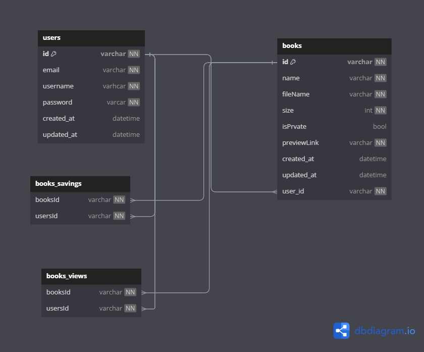

# BookReader

## App to share books with each other

Database Structure

## Technologies Used

### Frontend
- **Framework**: Vue.js
- **Language**: TypeScript
- **State Management**: Pinia
- **Routing**: Vue Router
- **UI Library**: Vuetify
- **Form Validation**: Vee Validate

### Backend
- **Framework**: NestJS
- **Language**: TypeScript
- **ORM**: TypeORM
- **Database**: PostgreSQL
- **File Upload**: Minio (for uploading PDF files)
- **CDN Service**: Cloudinary (for storing and retrieving book preview images quickly)
- **Image Processing**: ImageMagick + pdftopic (for extracting images from PDF files)
- **API Documentation**: Swagger